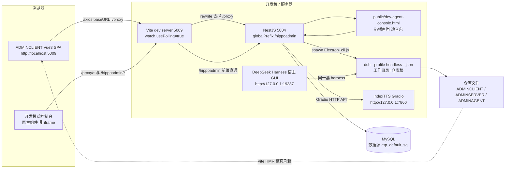

# 汇创管理端（底座 V1.0.0）系统架构

> 本文档面向**新人**：半天读完，能跑起来、能定位代码、知道哪里不能碰。
> 所有结论都能指到仓库内的具体文件；路径一律为**仓库内相对路径**。
> 代码是唯一权威来源，本文档与代码冲突时以代码为准，并请顺手改这里。

**路径书写约定**：默认全部是**仓库根相对路径**。为可读性，少数地方沿用模块内简写，对应关系如下：

| 简写前缀 | 实际相对路径 |
| --- | --- |
| `common/**`、`controller/**`、`services/**`、`dto/**`、`entities/**`、`module/**` | `ADMINSERVER/src/` + 该路径 |
| `components/**`、`pages/**`、`router/**`、`utils/**`、`stores/**`、`locales/**`、`api/**` | `ADMINCLIENT/src/` + 该路径 |
| `skills/**`、`agent/**`、`tools/**`、`harness/**` | `ADMINAGENT/` + 该路径 |
| `.github/workflows/*.yml`、`cicd/*.sh` | 前者为根相对；后者为 `ADMINSERVER/cicd/` + 文件名 |

---

## 1. 一句话总览 + 技术栈

**一句话**：一个「Vue3 后台 + NestJS 接口 + MySQL」的企业管理端底座，顶栏内嵌一个**开发模式控制台**——
说话或打字 → 后端把任务交给本机的 **DeepSeek Harness（DSH）** → Agent 直接改本仓库代码 → Vite 热更新，
页面**当场变化**；同时提供可选的本地 **IndexTTS** 语音播报，把 Agent 的答复念出来。

### 技术栈

| 层 | 技术 | 版本 / 出处 |
| --- | --- | --- |
| 前端 | Vue 3.5 · Vite 7 · TypeScript 5.9 · TDesign Vue Next 1.17 | `ADMINCLIENT/package.json` |
| 前端配套 | Pinia 3 · vue-router 4.5 · vue-i18n 11 · ECharts 6 + vue-echarts 8 · axios 1.12 · xlsx · nprogress | `ADMINCLIENT/package.json` |
| 前端测试 | Playwright（`e2e/vue.spec.ts`） | `ADMINCLIENT/playwright.config.ts` |
| 后端 | NestJS 10 · TypeORM 0.3.27 · MySQL（mysql2） · passport-jwt · bcrypt | `ADMINSERVER/package.json` |
| 后端配套 | class-validator / class-transformer · exceljs · xlsx · puppeteer · bwip-js · dayjs | `ADMINSERVER/package.json` |
| 运行时 | Node `^20.19.0 \|\| >=22.12.0`（CI 用 Node 20） | `ADMINCLIENT/package.json:6-8`、`.github/workflows/ci-server.yml:44` |
| 包管理器 | **pnpm 10.30.1**（后端锁定；前端 CI 走 npm ci） | `ADMINSERVER/package.json:7`、`ci-server.yml:39` |
| 启动器 | Node 脚本（`QuickStart/*.js`）+ `quick_start.bat` | `QuickStart/quick_start.js` |
| 智能体 | DeepSeek Harness（DSH）源码，包名 `@deepseek-ai/dsh-root` v0.2.0-rc.2 | `ADMINAGENT/harness/package.json` |
| 语音合成 | IndexTTS（Gradio WebUI），协议实测于 Gradio 5.45 | `ADMINSERVER/src/services/system/tts.service.ts:13-18` |
| 数据库 | MySQL 数据源名固定 `etp_default_sql`，`synchronize: true` | `ADMINSERVER/src/app.module.ts:27-44` |

---

## 2. 仓库结构

| 目录 | 职责 | 关键入口 |
| --- | --- | --- |
| `ADMINCLIENT/` | 前端 SPA（页面、组件、路由、请求封装、i18n、主题） | `src/main.ts`、`src/router/index.ts` |
| `ADMINSERVER/` | 后端 API（NestJS 模块/控制器/服务/DTO/实体）、审计、系统运维、开发模式、TTS 桥 | `src/main.ts`、`src/app.module.ts` |
| `QuickStart/` | 统一启动器 + 菜单登记/拆分脚本（Node，无第三方依赖） | `quick_start.js`、`start_index_tts.js` |
| `ADMINAGENT/` | 智能体能力区：`harness/`（DSH 源码）+ `skills/` + `agent/` + `tools/` | `ADMINAGENT/README.md` |
| `ADMINTTS/` | 可选的本地 IndexTTS（Python，体积大）——**不入库** | `ADMINTTS/webui.py` |
| `.github/workflows/` | CI（前端/后端）+ CD（SSH 部署） | `ci-server.yml`、`ci-client.yml`、`cd-server.yml` |

### 哪些东西被 gitignore、为什么

出处：根 `.gitignore`（逐条注释都写明了原因）。

| 被忽略 | 原因 |
| --- | --- |
| `node_modules/`、`.pnpm-store/` | 依赖 |
| `dist/`、`build/`、`*.tsbuildinfo` | 构建产物 |
| `logs/`、`*.log` | 运行时日志（**「系统运维 → 系统日志」读的就是后端 `logs/`**） |
| `backup/` | 系统运维保存 `.env` 前自动生成的备份目录（`ADMINSERVER/backup/env/`） |
| `.build-tmp/`、`.diag-*/`、`.verify-*/` | 构建/校验临时目录 |
| `ADMINTTS/` | IndexTTS 含 `.venv` + `checkpoints`，体积过大 |
| `ADMINAGENT/harness/docs/`、`.agents/`、`snapshots/` | 上游文档/测试快照/Agent Notes 约 46MB，非运行必需；**harness 只提交代码** |
| `.env`、`.env.local`、`.env.*.local` | 本地环境覆盖；注意 `.env.development` / `.env.production` 是**已跟踪**的文件 |

另：`.gitattributes` 对 `*.sh` / `*.yml` / `*.yaml` 强制 **LF**——Windows 的 CRLF 会让 Linux（CI/服务器）报 `bad interpreter`。

---

## 3. 运行时拓扑



要点（都有出处）：

- 前端 baseURL 是 `/proxy`，由 Vite 代理到 `VITE_SERVER_URL`（`ADMINCLIENT/.env.development:11` = `127.0.0.1:5004`，配置在 `ADMINCLIENT/vite.config.ts:44-58`）。
- `/hippoadmin` 另有一条**不重写**的代理，专供后端直出的独立控制台页面（`vite.config.ts:51-57`）。
- 后端接口前缀统一 `/hippoadmin`，监听端口取 `PORT`，未配置时 **5004**（`ADMINSERVER/src/main.ts:18,32`）。
- DSH 宿主 GUI 的 `19387` 是 **DSH 自身的端口**，不在本仓库里配置（本会话运行环境为 `http://127.0.0.1:19387`）——标**待确认**：以你机器上 DSH 实际监听的端口为准。

---

## 4. 后端架构

### 4.1 引导与全局设施（`ADMINSERVER/src/main.ts`）

| 项 | 说明 |
| --- | --- |
| 全局前缀 | `app.setGlobalPrefix('hippoadmin')`（`main.ts:18`） |
| 响应包装 | `TransformInterceptor`，全局注册（`main.ts:21-23`） |
| 异常 | `HttpExceptionFilter`，全局注册（`main.ts:29`） |
| CORS | `common/cors.ts`：`origin: true`、允许 `Authorization`、`credentials: true` |
| 日志 | `Logger.overrideLogger(new FileLogger())`（`main.ts:11`） |
| 校验 | **没有全局 ValidationPipe**，由控制器逐接口 `@UsePipes(new ValidationPipe())` 声明（例：`controller/system/dev-agent.controller.ts:54`） |

### 4.2 统一响应 `{ code, message, data }`

`TransformInterceptor`（`ADMINSERVER/src/common/transform.interceptor.ts`）：

1. **取 message**：返回体里若有 `message` 字段就作为 `message`，否则用默认 `操作成功`；随后从业务数据里**剔除**该字段（`:40-50`）。
2. **分页识别规则**（`:52-69`）：只要返回体**同时存在 `total` 和 `data` 两个属性**，就整体作为 `data` 返回 →
   `{ code: 2000, message, data: { total, data: [...] } }`。
   注意：**只看字段是否存在，不看类型**（上面的 `isPaginatedResult()` 辅助函数定义了但没被使用，`:16-25`）。
3. **数组 + `@ShowDataNum()`**（`:71-84`）：包成 `{ total: 数组长度, data: 数组 }`。
4. 其他：`{ code: 2000, message, data: businessData ?? null }`。

> 成功码是 **2000**（不是 200），前端一律用 `code === 2000` 判成功。
> 分页结果类型定义见 `common/types/pagination.types.ts`（`data/total/pageNumber/pageSize`），实际查询由 `common/services/pagination.service.ts` 与 `treePagination.service.ts` 完成。

### 4.3 业务异常 `BusinessException`

`common/exceptions/business.exception.ts`：继承 `HttpException`，**强制 HTTP 200**，响应体 `{ code, message, data: null }`，`code` 默认 **4000**。

| code | 含义 | 出处 |
| --- | --- | --- |
| 4000 | 业务失败（默认，含参数校验失败） | `business.exception.ts:13` |
| 4001 | 登录过期 | `common/verify-token.ts:39` |
| 4003 | 暂无该操作权限 | `common/guards/auth.guard.ts:45` |

全局异常过滤器 `common/http-exception.filter.ts` 同样把状态码压成 200，但响应体字段名是 **`msg`**：
`{ code, msg, data: null }`。**成功体用 `message`、异常体用 `msg`** —— 前端两个都读（`ADMINCLIENT/src/utils/request/index.ts:43-86` 读 `msg`）。

### 4.4 鉴权与权限

| 机制 | 实现 | 说明 |
| --- | --- | --- |
| 登录态（全局） | `common/verify-token.ts` 的 `AuthGuard`，注册为 **`APP_GUARD`**（`module/system/common.module.ts:61`） | 从 `Authorization: Bearer <jwt>` 取 token，`JwtService.verify`；失败分别抛 `请先登录`(4000) / `登录过期`(4001) |
| 公开接口 | `@Public()` → `common/decorators/public.decorator.ts` 的 `IS_PUBLIC_KEY` | 例：`common/login`、`common/verifyToken`、`system-ops/ping`、`dev-agent/console` |
| 接口级登录校验 | 各控制器再叠 `@UseGuards(AuthGuard('jwt'))`（passport） | 例：`dev-agent.controller.ts:25` |
| 操作权限 | `@Permission('Xxx.yyy')` + `AuthGuard as PermissionGuard`，见 `common/guards/auth.guard.ts` | 查 `role_operation` 表的 `role_id + operation_code`；**若接口没写 `@Permission` 就直接放行**（`:31`） |
| 当前用户 | `request.user` 由全局守卫写入 JWT payload（`{ sub, username, role_id }`），passport 版由 `common/strategies/jwt.strategy.ts` 映射为 `{ user_id, username, role_id }` | 审计拦截器两种都兼容（见 4.5） |

目前只有 `menu` / `role` / `user` / `tools/excel` 四个控制器用了 `@Permission`；
`system-ops`、`dev-agent`、`agent-admin`、`tts` 只做登录校验（各自文件头注释都写明了「如要收紧，参照 menu.controller.ts 补 `@Permission`」）。

> 注意：`app.module.ts:22-25` 注册了 1h 的 `JwtModule`，`module/system/common.module.ts:31-37` 又注册了一个 12h 的（secret 取 `JWT_SECRET`）。
> 两处重复，**实际生效的过期时间取决于模块解析顺序——标「待确认」**；`JwtStrategy` 直接读 `process.env.JWT_SECRET ?? 'hippoadmin'`。

### 4.5 操作审计（`common/interceptors/operation-log.interceptor.ts`）

挂在 `APP_INTERCEPTOR` 上（`module/system/system-ops.module.ts:25`），新增接口**无需写代码**即被审计。

| 规则 | 内容 |
| --- | --- |
| 记录范围 | `POST/PUT/PATCH/DELETE` 全部记录；`GET` 只在命中内置路由表中标了 `destructive` 的接口时记录（如 `GET menu/delete`）（`:169`） |
| 忽略路径 | `/audit/`、`/log/read`、`/log/files`、`/ping`、`/verifyToken`、`/refresh_token`（`:13-20`） |
| 操作名解析顺序 | ① `operation_list` 反查（`operation_port` 转正则，**60 秒内存缓存**，空 `operation_port` 跳过）→ ② 内置 `OPERATION_ROUTES` 路由表（`:55-108`，顺序敏感，具体路径在前）→ ③ `null`，前端退回展示 method + url |
| 摘要规则 | 最多 **6** 个字段；值超 **40** 字符视为长文本不记；密码/密钥类字段打码成 `***`；数组记 `key=[N项]`；跳过 `content/text/html/markdown/md/body/payload/data/base64`；`id/name/account/username/user/role/menu/dept/unit/title/code/status/type/key/count/total` 优先；总长 **120** 字符截断；嵌套最多 3 层（`:36-39,319-383`） |
| 落库字段 | `operation_log`：操作人、method/url、`action_name`/`action_sign`/`menu_id`、`summary`、`result_message`、`success`、`duration`、`ip`、`user_agent`（实体见 `entities/system/other/operation_log.entity.ts`） |
| 成功判定 | `code` 缺省或 `=== 2000` 视为成功；参数校验失败时 `message` 是数组，取第一条人话（`:215,389-398`） |
| 容错 | 写库失败只 `logger.warn`，**绝不影响业务**（`:233-235`） |

### 4.6 日志

`common/logger/file.logger.ts`：

- 按天写 `logs/app-YYYY-MM-DD.log`，目录可用 `LOG_DIR` 覆盖，默认 `<后端 cwd>/logs`。
- 单文件 **10MB** 上限，超限不再写（防止写满磁盘）。
- 控制台输出用原生 `console`（不能再用 Nest `Logger`，否则无限递归）。
- 读取入口：`GET /hippoadmin/system-ops/log/files`、`/log/read`（支持 `lines/level/keyword`）、`POST /log/clear`（`controller/system/system-ops.controller.ts:58-83`）。

### 4.7 后端目录约定

```
ADMINSERVER/src/
├── main.ts / app.module.ts      # 引导 + 根模块（TypeORM/Config/Jwt 注册）
├── common/                      # 拦截器 / 守卫 / 异常 / 装饰器 / 日志 / 分页 / 工具
├── controller/{system,business} # 控制器（按业务域分目录）
├── services/{system,business}   # 服务（业务逻辑）
├── dto/{system,business}        # DTO（class-validator 校验）
├── entities/{system,business}   # TypeORM 实体（database: 'etp_default_sql'）
├── enums/ · sql/default.sql     # 枚举 + 默认数据
└── module/{system,business}     # Nest 模块装配
```

业务模块：`menu`、`user`、`role`、`common`（登录/鉴权/菜单树）、`file`、`system-ops`、`dev-agent`、`agent-admin`（`app.module.ts:45-52`）。

---

## 5. 前端架构

### 5.1 入口（`ADMINCLIENT/src/main.ts`）

依次装配：Pinia → vue-router → TDesign → vue-i18n → 全局指令（`utils/directives/index.js`）→ 全局组件。
ECharts **按需注册**：只注册 `CanvasRenderer` + `Line/Pie/Bar` + `Grid/Tooltip/Legend/Title/Dataset`（`main.ts:25-57`）——
**新增图表类型必须在这里补注册**，否则图表静默空白。

### 5.2 DB 驱动的路由

1. 静态路由只有三条 + 兜底：`/`(Home)、`/login`、`/NotFound`；登录后动态追加 `/:pathMatch(.*)*` → `/NotFound`（`router/index.ts:14-39,85-88`）。
2. 守卫（`router/index.ts:43-103`）：白名单 `['/login']`；无 `localStorage.token` → 跳登录；
   有 token 且首次进入 → `userStore.getUserInfoForToken()`（`/hippoadmin/common/verifyToken`）拿 `menu_list` → `addMenuRoutes()` → `next({ ...to, replace: true })`。
3. `router/addMenuRoutes.ts` 是 DB 与代码的**唯一桥**：

| DB 字段（`entities/system/menu.entity.ts`） | 前端用途 |
| --- | --- |
| `component_name` | 路由 `name` 与 `path`（`/${component_name}`），同时是 **KeepAlive 的 key** |
| `component_address` | `import.meta.glob('@/**/*.vue')` 的**键**，必须是能命中的真实文件路径 |
| `is_cached` | 写入 `meta.is_cached`，决定是否进 KeepAlive |
| `menu_icon` / `menu_name` / `menu_id` | `meta.icon` / `meta.menu_name` / `meta.id` |
| `bi_path` | 有值时**不注册该路由**（外部 BI 页面） |

4. KeepAlive：`pages/Home/components/LayoutContent.vue:61-65` 用「已打开标签页中 `meta.is_cached` 的路由 `name` 集合」作 `:include`。
   → **`component_name` 必须与目标 `.vue` 的组件 `name` 完全一致**，否则缓存失效。

### 5.3 请求层（`ADMINCLIENT/src/utils/request/`）

| 文件 | 作用 |
| --- | --- |
| `ADMINCLIENT/src/utils/request/index.ts` | axios 实例：`baseURL: '/proxy'`、`timeout: 8000`；请求拦截注入 `Authorization = localStorage.token`；响应拦截按 `code` 弹提示 |
| `ADMINCLIENT/src/utils/request/request.ts` | 业务封装 `requestApi()`：`filterRes`（默认返回 `res.data` 即响应体）、`autoMsg`（`code===2000` 时自动 success 提示） |
| `mock/index.ts` | 开发期 Mock（`VITE_ENABLE_MOCK`：`false` / `auto` / `force`）；`force` 用 axios `adapter` 短路，`auto` 在请求失败时兜底 |

错误码处理（`index.ts:42-88`）：`4000` 提示；`4001` 清 token 并跳 `/login`（仅当 `msg === '令牌过期'` 才延迟跳，否则直接跳）；
`4003/4004/4005` 只提示。网络层错误另有 Mock 兜底 + `MessagePlugin.error`。
> 注意：后端登录过期时抛的是 **`登录过期`**（`verify-token.ts:39`），前端只特判了 `令牌过期` / `无效令牌` / `未提供身份认证`——
> 命中 `else` 分支（直接跳登录页），效果正确但分支名不匹配，属于历史遗留。

### 5.4 i18n 机制

- `locales/index.ts`：`createI18n({ legacy: false })`，语言键 `zh-CN` / `en-US`，持久化在 `localStorage['app-locale']`，首次按 `navigator.language` 推断。
- **服务端文本必须走 `translateServerText()`**：菜单名、列标题这类文本来自数据库，不会自动翻译。
  它按 `menuNames.<text>` → `columnTitles.<text>` → `apiMessage.<text>` 顺序查找，命中才 `t()`，否则**原样返回**；
  查之前先用 `te()` 判断，避免 vue-i18n 对每个未命中键刷 `Not found` 告警（`locales/index.ts:38-51`）。
- **坑**：新增服务端文案的中英对照，必须同步写进 `locales/zh-CN.ts` 与 `locales/en-US.ts` 的 `menuNames`（或 `columnTitles`/`apiMessage`），
  漏写就表现为「切到英文后这一块还是中文」。

### 5.5 主题 / 字号 / 亮度「三件套」

| 能力 | 实现 | 变量 / 存储 |
| --- | --- | --- |
| 主题色 + 暗黑 | `utils/theme.ts`（`initTheme` 在 `pages/Home/index.vue:26-29` 调用） | TDesign 主题变量 |
| 页面亮度 | `utils/theme.ts:137-160` | 写 `<html>` 的 `--app-dim-opacity`（0~0.5），由 `assets/styles/main.css:11-23` 的 `body::after` 黑色遮罩消费 |
| 页面字号 | `utils/fontScale.ts` | 写 `<html>` 的 `--app-font-scale`（85%~125% → 0.85~1.25），存储键 `app-font-scale` |

两条**必须遵守**的约定：

1. **亮度不用 `body { filter: brightness() }`**：`filter` 会让 `body` 成为 `position: fixed` 后代的包含块，
   TDesign 弹层/vue-devtools 悬浮球会脱离视口定位把文档撑高（实测视口 1300px → 文档 1356px，底部露出白块）。遮罩方案不参与布局（`theme.ts:141-147`）。
2. **所有字号都必须写成 `calc(Npx * var(--app-font-scale, 1))`**：
   `assets/styles/main.css:28-55` 把全部 `--td-font-size-*` token 乘上了该系数；
   自定义样式若写死 px，用户调字号时那一块就不跟着变。

### 5.6 布局与高度约定

- `pages/Home/index.vue`：`t-layout` 高 `100vh` + `t-header`（`LayoutHeader.vue`）+ `t-layout`（`LayoutSideNav` + `LayoutContent`）。
- `LayoutContent.vue:2,33`：标签栏容器 `calc(100vh - 56px)`，内容滚动区 `calc(100vh - 125px)`（56 = 顶栏，其余为标签栏）。
- **页面级**：`SystemOps/{About,Env,Log}`、`AgentAdmin/{Skill,Agent,Tool}`、`MenuManagement/{UserAdmin,AuthAdmin}` 的 `index.scss` 统一用
  `height: calc(100vh - 110px)` —— 新增「整屏不出现双滚动条」的页面请沿用这个值。
- 顶栏（`LayoutHeader.vue:62-110`）依次是：开发模式入口（`DevModeTool`）、主题、字号、语言、系统设置、全屏、用户菜单。
  左侧另有菜单搜索框（分类 + 最近搜索）。

---

## 6. 智能体层（ADMINAGENT）

### 6.1 四块分工（`ADMINAGENT/README.md`）

| 目录 | 回答的问题 | 形态 | 约定入口 |
| --- | --- | --- | --- |
| `harness/` | Agent 运行时本体（模型、工具、Agent Loop、会话持久化） | **上游 DSH 源码，不要改**（要改走上游或 `harness/patches/`） | `harness/package.json` |
| `skills/` | 「这类活该怎么干」 | 提示词（Markdown） | `<SkillName>/SKILL.md` |
| `agent/` | 「有哪些 Agent、各自负责什么、挂什么技能工具」 | 装配清单（Markdown） | `<agent-name>/AGENT.md` |
| `tools/` | 「能实际调用什么动作」 | 代码（Node/接口） | `<tool-name>/TOOL.md` |

核心区分：**skill = 做法/规范（提示词），tool = 能力（代码）；Agent = 人设 + 技能 + 工具**。

### 6.2 `skills/Workspace`：边界与提交纪律（优先级最高）

`ADMINAGENT/skills/Workspace/SKILL.md` 只做两件事：

1. **边界**：只允许改动本工作区（`git rev-parse --show-toplevel` = 本仓库根）内的文件；
   明确禁止动 `D:\software\deepseek-harness\**`（DSH 安装目录）、`C:\Users\**`、其它仓库；需要动外部时**先停下来问人**。
2. **留痕**：改完一个逻辑单元就提交一次（Conventional Commits + 中文），只 `git add` 自己的文件（禁止 `git add -A`），
   用配套脚本提交（做边界/黑名单/体积检查并打印回退命令），提交后推送（网络不通用 `git -c http.proxy=http://127.0.0.1:7892 push`）。
   文档里附了一张**回退手册**（`git show` / `checkout` / `revert` / `restore` / `reset --hard`）。

配套脚本：`ADMINAGENT/skills/Workspace/scripts/commit-workspace.mjs`
用法：`node ADMINAGENT/skills/Workspace/scripts/commit-workspace.mjs "<提交信息>" --files "a,b"` 或 `--all`。

当前已挂载的资产：

| 类型 | 资产 | 说明 |
| --- | --- | --- |
| skill | `Workspace`（`enabled: true`） | 边界 + 可回退提交（最高优先级） |
| skill | `Backend`（`enabled: true`） | NestJS 统一响应、`BusinessException`、鉴权/权限、DTO/实体规范、pnpm 隔离布局下必须显式声明依赖 |
| skill | `Frontend` | 页面骨架、`api.ts` 分层、i18n、BEM 与 `--td-*` 变量、字号必须 `calc(var(--app-font-scale))`、ECharts 只注册 Line/Pie/Bar |
| skill | `Frontend/workflow/new-page.md` | 新增页面到提交的完整流程（含菜单登记） |
| agent | `agent/vibe-admin/AGENT.md`（`enabled: true`） | 管理端开发 Agent，「开发模式」默认用它 |
| tool | `tools/dev-agent-generate/TOOL.md`（`enabled: true`） | 把一句话任务交给 DSH 执行并改代码 |

### 6.3 菜单里的「智能管理」三页如何管理这些 markdown

- 菜单登记脚本：`QuickStart/create_agent_admin_menus.js`（一个目录 + 三个子页面）。
- 后端：`services/system/agent-admin.service.ts` + `controller/system/agent-admin.controller.ts`，接口前缀 `/hippoadmin/agent-admin`。

| 接口 | 作用 |
| --- | --- |
| `GET /overview` | 三类资产数量 + harness 版本 + 开发模式是否就绪 |
| `GET /list?kind=skill\|agent\|tool` | 列表（标题取首个一级标题、描述取标题后第一段、启用状态来自 front matter） |
| `GET /detail?kind&name&file` | 指定文件内容 + 目录内文件清单（只读可看任意后缀） |
| `POST /create` · `POST /save` · `POST /remove` · `POST /node` · `POST /remove-node` | 新建条目 / 保存文件 / 删条目 / 建子目录或文件 / 删单个文件或目录 |
| `POST /enabled` | 按文件启用/停用 |
| `POST /polish` + `GET /polish/status` | AI 润色 + 进度轮询 |

安全模型（`ADMINSERVER/src/services/system/agent-admin.service.ts`）：只允许操作 `ADMINAGENT/<skills|agent|tools>` 内部；
名称走白名单 `^[A-Za-z0-9][A-Za-z0-9._-]{0,63}$`；路径片段白名单 + 解析后绝对路径必须落在根目录内（防目录穿越）；
在线保存只允许 `.md/.json/.ts/.js/.mjs/.yaml/.yml/.txt/.sh/.cmd`；单文件内容上限 200KB。
`AGENT_ADMIN_ROOT` 可覆盖资产根目录。

**按文件启用（front matter `enabled`）**：

- 只认主文档顶部 YAML front matter 里的 `enabled: true|false`；**没有 front matter 或没写 `enabled` 默认视为启用**（`:600-607`）。
- 写回策略：已有 front matter 就地改这一行，没有就在文件最前面补一个（`:609-624`）。
- 关键设计：状态写在 md 本身而不是另建配置文件——谁拿到这份 md 都能一眼看出它有没有被启用；
  且**只改当前选中的那个文件**，不影响同目录其它文件（`setEnabled` 的 `file` 参数）。

**AI 润色（异步 runId + 轮询）**：

1. `POST /hippoadmin/agent-admin/polish` → 拼一段强约束 prompt（只改这一个文件、保持标题/表格/列表/链接/事实不变、
   front matter 必须逐字节不变、必须真的落盘）→ `DevAgentService.startBackgroundSyncTask(prompt, runId)` → **立刻返回 `{ started, runId, beforeSize }`**（`:291-330`）。
2. 前端拿 `runId` 轮询 `GET /polish/status?kind&name&file&runId`，返回 `running / ok / exitCode / duration / output / error / size`（`:339-372`）。
3. **为什么必须比对磁盘内容**：DSH 正常退出（exit=0）不代表文件真被改写（可能被文件策略拦下、只回答了没落盘），
   只看退出码会得到「提示润色完成、文件却一动不动」的假成功（`:284-290,334-338`）。
4. 为什么改成异步：一次润色实测约 100 秒，同步接口会让前端长时间空等，用户以为失败而反复点击，
   而并发锁只允许一个任务 → 后续点击全报错，表现就是「AI 润色无法使用」（`dev-agent.service.ts:402-417`）。

---

## 7. 开发模式（Vibe 开发链路）

### 7.1 端到端链路

```
语音 / 文字
  → POST /hippoadmin/dev-agent/generate        （channel: reply | code）
      reply：同步跑，只回一两句答复（前端 TTS 播报），prompt 里明确要求「不改任何文件」
      code ：立刻返回 runId，后台执行
  → dsh --profile headless [--session-id ID] --json "<任务>"
  → 解析 --json 的 NDJSON 事件流（轨迹 + sessionId + final text + error）
  → git status --porcelain 前/后快照对比，得出「改了哪些文件」
  → 改动文件后缀归一比对菜单里的 component_address → router.push(`/${component_name}`)
  → Vite HMR / 整页刷新，页面实时变化
```

### 7.2 后端（`services/system/dev-agent.service.ts`、`controller/system/dev-agent.controller.ts`）

| 接口 | 说明 |
| --- | --- |
| `GET /dev-agent/status` | dsh 是否就绪、cli 路径、工作目录、超时、是否正在跑、最近一次结果 |
| `GET /dev-agent/profiles` | 读 `$DSH_HOME/profiles` 下的 profile 列表（只有 `headless` 标 `oneShot`） |
| `GET /dev-agent/runs` | 执行历史（内存态，最多 20 条，重启即清空） |
| `POST /dev-agent/generate` | `GenerateCodeDto`：`prompt`(≤4000)、`channel`(reply/code)、`cwd`、`profile`、`sessionId` |
| `GET /dev-agent/console` | `@Public()` 直出 `ADMINSERVER/public/dev-agent-console.html`（独立控制台页面） |

关键实现细节：

- **不经过 shell**：解析 `dsh.cmd` 取出 Electron 可执行文件 + `cli.js`，直接 `spawn(exe, ['--expose-internals', cli, '--profile', profile, ...])`，
  env 加 `ELECTRON_RUN_AS_NODE=1`，避免任务文本里的引号/特殊字符造成命令注入（`:113-116,643-665`）。
- **启动器解析**：`DSH_CLI_PATH` / `DSH_INSTALL_DIR` → `resources/runtime/cli/bin/dsh.cmd` → 默认安装位置 → `PATH`（`:15-20,741-808`）。
- **工作目录**：默认仓库根（`process.cwd()/..`，即 `ADMINSERVER` 的上一级），可用 `DSH_AGENT_CWD` 覆盖（`:811-815`）。
- **超时**：默认 5 分钟（`DSH_AGENT_TIMEOUT`，上限 30 分钟）；简短回复 90 秒（`DSH_REPLY_TIMEOUT`）；同步任务（润色）8 分钟（`DSH_POLISH_TIMEOUT`）。超时用 `taskkill /pid <pid> /f /t` **杀进程树**（Windows 下 `child.kill` 杀不干净）。
- **单任务并发锁**：`private running = false`；`requireLauncher()` 里若在跑就抛 `已有一个任务正在执行，请等它结束`（`:122,389-392`）。
- **会话**：传 `sessionId` 即在同一 DSH 会话里连续追问；返回体把实际 `sessionId` 交还前端持久化。

### 7.3 为什么必须 `--json`

`--json` 让 DSH 把运行过程输出成**一行一条的 NDJSON 事件**，后端 `parseRunEvents()` 靠它拿到：

- `type: 'session'` → `sessionId`（前端做连续对话的关键）；
- `type: 'final' | 'text'` → Agent 最终答复（拿不到才退回 stdout 尾部）；
- `type: 'error'` → 失败原因（**DSH 报错时进程仍可能以 0 退出**，只有这一路能把「为什么没改成」告诉用户）；
- 全部事件 → 控制台的「Agent 执行过程」轨迹面板（最多保留 300 条、单字段截断 400 字符、只传标量字段）。

### 7.4 控制台 UI（`ADMINCLIENT/src/components/DevModeConsole/`）

| 部分 | 实现 |
| --- | --- |
| 入口 | `components/DevModeTool`（顶栏，`LayoutHeader.vue:65`） |
| 主体 | `index.vue`（约 2000 行，**原生 Vue 组件**）+ `index.scss` |
| 球体神经网络 | `controller/mesh.ts`（186 球面节点 + 14 核心节点；执行态球体散开淡出、只剩波纹） |
| 语音输入 | `controller/voice.ts`（`getUserMedia` + `AudioContext` 白色音轨） |
| 语音播报 | `controller/speech.ts`（IndexTTS 优先，失败自动回退浏览器 `speechSynthesis`） |
| 幕布 | 整屏**浅色幕布 `pointer-events: auto`**：系统页面透过幕布看得见、但点不动；球体/输入区/面板 z-index 更高照常可点（`index.scss:1-30`，`index.vue:3-5`） |
| 面板 | 「对话 + 轨迹」面板 + 两个滑块（面板背景透明度、**幕布浓度**，写 localStorage） |
| 状态持久化 | 刷新后自动接管后端仍在跑的任务（最长 30 分钟），Agent 不会被打断（`index.vue:508-509`） |

**为什么控制台不放 iframe**：Agent 一改前端代码就会触发 Vite 热更新甚至整页刷新，
如果控制台跑在应用里（或在 iframe 里），每次生成都会被刷掉、开发模式被迫关闭
（`controller/system/dev-agent.controller.ts:59-67` 的注释写明了这一点）。
因此另有后端直出的独立页 `ADMINSERVER/public/dev-agent-console.html`，由 `/hippoadmin/dev-agent/console` 提供、**不经过 Vite**；
页面无需登录（token 由主窗口通过 URL hash 传入），但页面调用的接口仍要带 token，所以外人拿到 HTML 也驱动不了 Agent。

### 7.5 改动文件 → 菜单路由 → 前端跳转

`index.vue:1194-1314`：

1. 后端返回 `files: [{ status, path }]`（来自 `git status --porcelain` 前后对比）。
2. `collectMenuPages()` 递归收集菜单树里所有「带 `component_address` + `component_name`」的页面。
3. `isSamePageFile()` 做**后缀归一化比对**：`/src/pages/SystemOps/Log/index.vue` ↔ `ADMINCLIENT/src/pages/SystemOps/Log/index.vue`。
4. 命中多个时取第一个**非 `ADMINAGENT/`** 的前端页面；都没命中则提示「已应用，未匹配到菜单」并留在当前页。
5. 跳转前后写 `localStorage['dev-mode-navigated-run']` 记账，**每条完成记录只自动跳一次**——
   否则会出现「跳转 → 守卫发现未登录 → 弹回登录页 → 组件重挂载 → 又跳」的死循环（`:1264-1314`）。

---

## 8. TTS 桥（ADMINTTS / IndexTTS）

### 8.1 拓扑与接口

```
ADMINCLIENT --fetch /proxy--> NestJS /hippoadmin/dev-agent/tts --> Gradio http://127.0.0.1:7860
```

| 接口 | 说明 |
| --- | --- |
| `GET /dev-agent/tts/status` | 永远返回 200：`reachable / baseUrl / home / items(参考音色) / defaultVoice / ready / hint` |
| `POST /dev-agent/tts` | 合成：`text`（≤500 字）、`voice`（`examples/*.wav` 白名单）、`lang`（`ZH/EN/JA/AR/ES`） |
| `GET /dev-agent/tts/audio?file=` | 流式返回 wav；文件名白名单 + 绝对路径必须落在 `outputs/` 内（双重防穿越），`Cache-Control: private, max-age=300` |

实现：`services/system/tts.service.ts`、`controller/system/tts.controller.ts`。

### 8.2 Gradio 三步协议（实测 Gradio 5.45）

1. `POST {base}/gradio_api/upload`：multipart 上传参考音色 → 返回服务端路径数组。
2. `POST {base}/gradio_api/call/gen_single`：`{"data":[26 个位置参数]}` → `{ event_id }`。
3. `GET {base}/gradio_api/call/gen_single/{event_id}`：SSE，取 `event: complete` 的 data → 音频文件 `{ path, url }`。
4. 把音频**复制进** `ADMINTTS/outputs/`，对外只暴露这个目录（Gradio 的 `gradio/<hash>/` 目录名不可预测、不便白名单校验）；
   `audioMs` 直接解析 wav 头（`fmt`/`data` 块）算出来，不引依赖。

### 8.3 26 个位置参数的用途分类

顺序**必须**与 `ADMINTTS/webui.py` 的 `gen_single` 签名一致（`tts.service.ts:260-289`）：

| 下标 | 参数 | 分类 / 用途 |
| --- | --- | --- |
| 0 | `emo_control_method` | 情感控制方式（当前固定 `与音色参考音频相同`） |
| 1 | `prompt` | **音色参考音频**（上传后的 FileData） |
| 2 | `text` | 待合成文本 |
| 3 | `lang_choice` | 语言 |
| 4–5 | `emo_ref_path` / `emo_weight` | 情感参考与权重 |
| 6–13 | `vec1..vec8` | 8 维情感向量 |
| 14–15 | `emo_text` / `emo_random` | 文本描述情感、随机情感 |
| 16 | `max_text_tokens_per_segment` | **文本分段**（长文本切段上限） |
| 17 | `duration_factor` | **时长系数**（语速/时长缩放） |
| 18–22 | `do_sample` / `top_p` / `top_k` / `temperature` / `length_penalty` | **采样策略** |
| 23–25 | `num_beams` / `repetition_penalty` / `max_mel_tokens` | **解码与长度约束** |

> 仓库工作区里已有一份**未提交**的改动，正在把这 26 个参数变成可在管理端调整的配置（`ADMINAGENT/tts-config.json` + 参数校验）——
> 标「进行中」，不要以为文档写错。当前提交版本的行为就是上表 + 固定默认值。

### 8.4 中文路径必须 subst 到 ASCII 盘符

- **原因**：wetext 依赖的 `kaldifst` 用**窄字符 `fopen`** 打开 `.fst` 规则文件，非 ASCII（中文）路径必然失败，
  表现为 `RuntimeError: kaldi-io.cc ... Error opening input stream ...fst`（`QuickStart/start_index_tts.js:28-33`、`tts.service.ts:20-25`）。
- **对策**：脚本检测到路径含非 ASCII 时，用 `subst` 把一个空闲盘符映射到 `ADMINTTS`，从纯 ASCII 路径启动 Python；
  已有映射则复用（`findExistingBridge`），否则新建（`createBridge`）。**映射在 IndexTTS 运行期间必须保留**，不需要时 `subst <盘符>: /d` 手动删除。
- 兜底：`--no-subst` 可关闭桥接（会警告大概率启动失败）；中文路径且无桥接时优先改用兼容启动器 `dsh_tts_launch.py`。
- 提示：后端在不可达时的 `hint` 里也会把这段原因和命令写给用户（`tts.service.ts:143-157`）。

### 8.5 `QuickStart/start_index_tts.js` 用法与 `--supervise` 的必要性

```bash
node QuickStart/start_index_tts.js [选项]

--port <端口>      默认 7860
--host <地址>      默认 127.0.0.1（避免 Windows 防火墙弹窗）
--fp16             半精度加载（显存小时用）
--foreground       前台运行、实时打印（排查报错用）
--timeout <秒>     后台等待就绪最长时间，默认 600
--home <路径>      ADMINTTS 目录（也可用环境变量 INDEX_TTS_HOME）
--entry <文件>     入口脚本，默认 webui.py
--extra "<参数>"   追加透传给入口脚本的原始参数
--no-subst         禁用 ASCII 盘符桥接
--supervise        后台启动后不退出，持续转发子进程输出（供 quick_start.js 调用）
```

- 解释器优先级：`.venv` → `uv run`（有 `uv.lock`）→ 系统 `python/python3`；日志写 `ADMINTTS/logs/index-tts.log`。
- 退出码：`0` 已在运行 / 后台启动成功 / 未找到 ADMINTTS（可选服务优雅跳过）；`1` 显式 `--home` 无效、启动失败、超时或提前退出。
- **`--supervise` 为什么必要**：`quick_start.js` 需要「包装进程一直活着」——
  这样它会持续转发 Python 的输出、并在整体退出时用 `taskkill /pid <pid> /f /t` **连 Python 一起清掉**，
  否则关掉启动器后 IndexTTS 会变成孤儿进程继续占着 7860。
- 另一个反直觉点：**不能用 `detached` / `windowsHide` 创建「无控制台」进程**，
  否则 MKL 的 Intel Fortran 运行时会在加载模型时以 `forrtl: error (200) ... window-CLOSE event` 退出（退出码 2）（`start_index_tts.js:574-584`）。

### 8.6 前端为什么要 fetch Blob

`/tts/audio` 需要 JWT，而 `<audio src>` 这类媒体加载由**浏览器直接发请求、不会带 `Authorization` 头**，
结果是静默失败 `MEDIA_ERR_SRC_NOT_SUPPORTED`（error code 4）。
所以前端用带鉴权的 `fetch` 把音频读成 `Blob` 再转 `blob:` URL（`ADMINCLIENT/src/api/devAgent.ts:277-298`），
用完由调用方 `URL.revokeObjectURL`；对应的播放状态机在 `DevModeConsole/controller/speech.ts`（同一时刻只响一段，切段前先 `cancel()`）。

---

## 9. 启动与运维

### 9.1 一键启动

```bash
quick_start.bat                       # Windows：chcp 65001 → node QuickStart\quick_start.js
node QuickStart/quick_start.js        # 等价命令
```

`QuickStart/quick_start.js` 流程与开关：

| 步骤 / 参数 | 说明 |
| --- | --- |
| 解析 env | 依次读 `ADMINCLIENT/{.env,.env.local,.env.development,.env.development.local}` 与后端同名文件，推导前后端地址 |
| 依赖检查 | `node_modules/<包名>/package.json` 存在即视为已安装（同时兼容 npm 与 pnpm 的目录结构）；缺依赖则**自动安装**，包管理器优先 `pnpm`，回退 `npm`（可用 `HC_PACKAGE_MANAGER` 强制）；顺序执行避免争抢全局 store |
| 启动顺序 | 先后台拉 IndexTTS（不阻塞）→ 依赖检查 → `ADMINSERVER: npm run start:dev` → `ADMINCLIENT: npm run dev` → 打开浏览器 |
| `--no-tts` | 跳过 IndexTTS（静默） |
| `--tts-only` | 只启动 IndexTTS，不启动前后端 |
| `--dry-run` | 只打印解析出的配置，不启动任何服务 |
| `--skip-install` | 跳过依赖检查直接启动 |
| `--tts-port` / `--tts-timeout` | TTS 端口（默认 7860）/ 就绪等待秒数（默认 600） |
| 退出清理 | `SIGINT/SIGTERM` → 对每个子进程 `taskkill /pid <pid> /f /t`（Windows）/ `kill(-pid)`，1 秒后退出；TTS 退出**不**触发整体关闭（可选服务） |

其他 QuickStart 脚本（都是「调接口登记数据库菜单」，可重复执行、支持 `--dry-run`）：

| 脚本 | 作用 |
| --- | --- |
| `create_system_ops_menu.js` | 创建「系统运维」目录 / 菜单 / 菜单配置（可选 `--grant-role` 授权） |
| `split_system_ops_menus.js` | 把「系统运维」拆成 关于系统 / 系统日志 / 环境配置 三个子页 |
| `create_agent_admin_menus.js` | 登记「智能管理」目录 + Skill / Agent / Tool 三个子页 |

### 9.2 「改了后端必须 build + 重启」

- 生产/服务器走 `pnpm run build` → `node dist/main`（PM2 托管）。
- **坑（团队经验，无代码出处）**：只改 `src` 不重新 `build`，跑起来的还是旧 `dist`，行为与代码不一致——
  踩过的具体表现是「以为新逻辑已生效，结果用旧逻辑**误删了技能**」。
  所以：动过后端代码 → `pnpm run build` → 重启（PM2 `pm2 reload main --update-env` 或页面「系统运维 → 保存并重启」）。
- 开发态用 `npm run start:dev`（`nest start --watch`）时热重载一般够用，但**跨模块/实体结构变更**仍建议全量重启。

### 9.3 审计与日志在哪里看

| 想看什么 | 入口 |
| --- | --- |
| 谁在什么时候改了什么（人话） | 前端「系统运维 → 系统日志」页（`ADMINCLIENT/src/pages/SystemOps/Log/`），数据来自 `GET /hippoadmin/system-ops/audit/list`，落库表 `operation_log` |
| 操作类型下拉选项 | `GET /hippoadmin/system-ops/audit/actions`（由 `operation_list` 反查） |
| 服务端原始日志 | `GET /hippoadmin/system-ops/log/files` + `/log/read`（级别/行数/关键字筛选），文件在 `ADMINSERVER/logs/app-YYYY-MM-DD.log` |
| 服务状态/资源/数据库连接 | `GET /hippoadmin/system-ops/about`、`/metrics`（BI 看板折线图数据源，5s 采样、保留 120 点 = 最近 10 分钟） |
| 环境变量与重启 | `GET /system-ops/env/detail`、`POST /system-ops/env/save`（保存前自动备份到 `ADMINSERVER/backup/env/`）、`POST /system-ops/restart` |

重启策略（`system-ops.service.ts:480-540`）：检测到 `pm_id`/`PM2_HOME` → **PM2**（`process.exit(0)` 交给 PM2 拉起）；
否则若存在 `src/main.ts` → **watch**（更新入口文件 mtime 触发 `nest start --watch` 重新编译）；
两者都不满足 → **manual**（不结束进程，明确告诉用户需手动重启）。三种方式都先返回响应、延迟 1 秒再执行。

---

## 10. CI/CD

### 10.1 工作流

| 工作流 | 触发 | 内容 |
| --- | --- | --- |
| `.github/workflows/ci-server.yml` | `ADMINSERVER/**`、`QuickStart/**` 推到 `main`/`develop`、PR、手动 | pnpm 10.30.1 + Node 20 → `cicd/install.sh` → `SKIP_INSTALL=1 cicd/build.sh` → `cicd/test.sh` → 上传 `ADMINSERVER/dist` 产物（保留 7 天） |
| `.github/workflows/ci-client.yml` | `ADMINCLIENT/**` 推到 `main`/`develop`、PR、手动 | Node 20 + `npm ci` → `npm run build-only`（`NODE_OPTIONS=--max-old-space-size=4096`）→ `npm run type-check`（**`continue-on-error: true`**，因为仓库有约 100 处历史类型错误，暂不阻断）→ 上传 `ADMINCLIENT/dist` |
| `.github/workflows/cd-server.yml` | 手动触发（可选分支 / 可 `skip_git`）、推送 `v*` 标签 | 校验 Secrets → 配置 SSH → 远端 `bash ADMINSERVER/cicd/deploy.sh`；若仓库变量 `DEPLOY_WEB=true`，额外构建前端并 `rsync` 到 `WEB_PATH` |

两个 CI 都设了 `concurrency` + `cancel-in-progress`；CD 的 `concurrency.cancel-in-progress: false`（部署不允许并发）。

### 10.2 `ADMINSERVER/cicd/*.sh`（本地 / 服务器 / CI 三处行为一致）

| 脚本 | 作用 |
| --- | --- |
| `common.sh` | 公共函数：定位 `CICD_DIR/SERVER_DIR/REPO_DIR`、`detect_pkg_manager`（`PKG_MANAGER` > 有 `pnpm-lock.yaml` 且装了 pnpm > npm）、`pkg_install`（pnpm 用 `--frozen-lockfile`，npm 有锁文件用 `npm ci`）、`run_script` |
| `install.sh` | 安装依赖 |
| `build.sh` | 安装依赖 + `nest build`；`SKIP_INSTALL=1` 跳过安装；`RUN_TESTS=1` 额外跑单元测试 |
| `test.sh` | 单元测试；`src` 下没有任何 `*.spec.ts` 时直接跳过（pnpm 严格布局下 jest 传递依赖解析不到） |
| `deploy.sh` | 服务器端：`git fetch` + `git reset --hard origin/<branch>`（`SKIP_GIT=1` 跳过）→ 装依赖 → 构建 → `restart.sh` → `health-check.sh` |
| `restart.sh` | `pm2 reload <PM2_APP_NAME> --update-env`（失败回退 `pm2 restart`）+ `pm2 save` |
| `health-check.sh` | 轮询 `HEALTH_CHECK_URL`（默认 `http://127.0.0.1:5004/hippoadmin/system-ops/ping`），`grep '"code":2000'` 视为通过；默认重试 15 次 × 2 秒 |

环境变量一览见 `ADMINSERVER/cicd/README.md`。

### 10.3 需要的 Secrets / Variables

**Secrets**：`SSH_HOST`、`SSH_USER`、`SSH_PRIVATE_KEY`（公钥写入服务器 `~/.ssh/authorized_keys`）、`SSH_PORT`（可选，默认 22）。

**Variables**：`DEPLOY_PATH`（服务器仓库绝对路径，**必填**）、`PM2_APP_NAME`（默认 `main`）、
`DEPLOY_WEB`（填 `true` 才执行前端发布任务）、`WEB_PATH`（前端站点目录，`DEPLOY_WEB=true` 时必填）。

### 10.4 已知部署注意事项

- `ADMINSERVER/ecosystem.config.js` 里 `cwd: '/www/main'` 是**旧布局**；改成 monorepo 后后端实际路径是 `<DEPLOY_PATH>/ADMINSERVER`，
  不同步修改 PM2 会找不到 `dist/main.js`（`ADMINSERVER/cicd/README.md:76-78`）。
- 服务器前置：Node 20+、`git`、`curl`、`pm2`；健康检查失败用 `pm2 logs <PM2_APP_NAME> --lines 100` 或页面「系统日志」排查看。

---

## 11. 已知约束与坑（务必读）

| # | 约束 / 坑 | 现象 | 对策 | 出处 |
| --- | --- | --- | --- | --- |
| 1 | **pnpm 版本锁定 10.30.1** | 用 pnpm 9 装后端会因锁文件解析差异失败 | 后端统一 pnpm 10.30.1；CI 显式指定该版本；前端走 npm | `ADMINSERVER/package.json:7`、`ci-server.yml:37-39` |
| 2 | **Windows 大小写不敏感 / Linux 区分大小写** | 本机跑得通，CI 或服务器上 `Cannot find module` | import 路径大小写必须与磁盘完全一致（提交自检清单里的一条） | `ADMINAGENT/skills/Frontend/SKILL.md`、`skills/Backend/SKILL.md` |
| 3 | **Vite 文件监听漏事件** | 「硬盘上代码是新的，dev server 一直吐旧模块」 | 已开 `server.watch.usePolling: true, interval: 400` | `ADMINCLIENT/vite.config.ts:36-43` |
| 4 | **`transform.interceptor` 的分页识别** | 返回体里只要同时有 `total` + `data`，就被当成分页整体塞进 `data` | 业务对象**避免**同时出现这两个字段名；数组要 `{total,data}` 就用 `@ShowDataNum()` | `common/transform.interceptor.ts:52-69` |
| 5 | **成功体 `message` vs 异常体 `msg`** | 前端读错字段就提示空 | 成功走 `data.message`，异常走 `data.msg` | `transform.interceptor.ts:64-68` vs `http-exception.filter.ts:24-30` |
| 6 | **`<audio src>` 带不上 JWT** | 音频静默播放失败（`MEDIA_ERR` error 4） | 先带鉴权 `fetch` 成 Blob，再 `URL.createObjectURL`，用完 revoke | `ADMINCLIENT/src/api/devAgent.ts:277-298` |
| 7 | **ASCII 路径**（kaldifst 窄字符 `fopen`） | 中文路径下 IndexTTS 报 `Error opening input stream ...fst` | 必须用 `node QuickStart/start_index_tts.js` 启动（自动 subst 盘符桥接），且运行期间保留该映射 | `start_index_tts.js:28-33`、`tts.service.ts:20-25` |
| 8 | **单任务并发锁** | 第二个任务直接报「已有一个任务正在执行」；同步长任务会让前端空等、用户反复点导致全失败 | 只有 `DevAgentService.running` 一个任务在跑；长任务（AI 润色）改为**异步 runId + 轮询**，忙也以一条失败运行记录呈现 | `dev-agent.service.ts:122,389-392,402-450` |
| 9 | **DSH `headless` 没有 `--model` 参数** | 界面上的「模型」只能展示、不能选择 | 模型跟随 profile 配置；读不到就显示 `devMode.modelUnknown` | `DevModeConsole/index.vue:294,806-809` |
| 10 | **改了后端必须 build + 重启** | 跑的还是旧 `dist`，行为与代码不一致（曾因此误删技能） | `pnpm run build` → 重启（PM2 reload 或页面「保存并重启」）——团队经验，无代码出处 | 见 9.2 |
| 11 | **改 `.env` 后必须重启才生效** | 页面保存了配置但行为没变 | `POST /system-ops/env/save` 传 `restart: true`，或手动重启 | `system-ops.controller.ts:120-134` |
| 12 | **动态路由双字段强耦合** | 页面白屏 / KeepAlive 失效 / 404 | DB 的 `component_name` 必须等于目标 `.vue` 的组件 `name`；`component_address` 必须是 `import.meta.glob('@/**/*.vue')` 能命中的真实路径 | `router/addMenuRoutes.ts:1-25`、`LayoutContent.vue:61-65` |
| 13 | **服务端文本不会自动翻译** | 切英文后菜单/列标题仍是中文 | 一律走 `translateServerText()`，并在 `locales/{zh-CN,en-US}.ts` 的 `menuNames`（或 `columnTitles`/`apiMessage`）补齐对照 | `locales/index.ts:38-51` |
| 14 | **控制台不能跑在应用内 / iframe 里** | Agent 一改前端就被 HMR 刷掉，开发模式被迫关闭 | 用原生组件 + 幕布；另保留后端直出的独立页 `/hippoadmin/dev-agent/console` | `dev-agent.controller.ts:59-67`、`DevModeConsole/index.vue:3-5` |
| 15 | **`AGENT_DIR_PREFIX` 不参与跳转** | Agent 改 `ADMINAGENT/**` 时不该跳页面 | 命中多个文件时优先取第一个非 `ADMINAGENT/` 的前端页面 | `DevModeConsole/index.vue:512-513,1247-1262` |
| 16 | **ECharts 按需注册** | 用了未注册的图表类型 → 空白无报错 | 先在 `main.ts` 的 `use([...])` 里补注册 | `ADMINCLIENT/src/main.ts:25-57` |

---

## 附录：关键文件索引

| 关注点 | 文件 |
| --- | --- |
| 后端引导 | `ADMINSERVER/src/main.ts`、`ADMINSERVER/src/app.module.ts` |
| 统一响应 / 异常 / 鉴权 / 审计 / 日志 | `ADMINSERVER/src/common/{transform.interceptor.ts,http-exception.filter.ts,verify-token.ts,cors.ts}`、`common/exceptions/business.exception.ts`、`common/guards/auth.guard.ts`、`common/decorators/{public,showDataNum}.decorators.ts`、`common/interceptors/operation-log.interceptor.ts`、`common/logger/file.logger.ts` |
| 开发模式 | `ADMINSERVER/src/services/system/dev-agent.service.ts`、`controller/system/dev-agent.controller.ts`、`ADMINSERVER/public/dev-agent-console.html` |
| 智能管理 | `ADMINSERVER/src/services/system/agent-admin.service.ts`、`controller/system/agent-admin.controller.ts` |
| 系统运维 | `ADMINSERVER/src/services/system/system-ops.service.ts`、`controller/system/system-ops.controller.ts`、`entities/system/other/operation_log.entity.ts` |
| TTS 桥 | `ADMINSERVER/src/services/system/tts.service.ts`、`controller/system/tts.controller.ts` |
| 前端路由 | `ADMINCLIENT/src/router/index.ts`、`router/addMenuRoutes.ts`、`stores/{userStore,menuStore}.ts` |
| 前端请求 | `ADMINCLIENT/src/utils/request/{index.ts,request.ts,mock/index.ts}`、`src/api/devAgent.ts` |
| 前端布局与三件套 | `ADMINCLIENT/src/pages/Home/**`、`src/utils/{theme.ts,fontScale.ts}`、`src/assets/styles/main.css` |
| 开发模式控制台 | `ADMINCLIENT/src/components/DevModeConsole/{index.vue,index.scss,controller/{mesh,voice,speech}.ts}` |
| 启动与 CI/CD | `quick_start.bat`、`QuickStart/*.js`、`.github/workflows/*.yml`、`ADMINSERVER/cicd/*.sh` |
| 智能体资产 | `ADMINAGENT/README.md`、`ADMINAGENT/skills/**`、`ADMINAGENT/agent/**`、`ADMINAGENT/tools/**` |
| 上游文档（未入库） | `ADMINAGENT/harness/docs/architecture.md`（DSH 自身架构，非本项目架构） |

### 待确认 / 本文档未 100% 落实的点

1. DSH 宿主 GUI 端口 `19387`：不在本仓库配置，请以你机器上 DSH 实际端口为准。
2. `JwtModule` 在 `app.module.ts`（1h）与 `module/system/common.module.ts`（12h）**重复注册**，实际生效的过期时间取决于模块解析顺序，未实测。
3. 「旧 dist 导致误删技能」只作为团队经验记录（第 11 节 #10），仓库内没有对应代码/工单出处。
4. IndexTTS 26 参数的**可配置化**（`ADMINAGENT/tts-config.json`）在写作时仍是**未提交的工作区改动**，尚未进入本架构的稳定描述。
5. 仓库内 `.env.development` 指向的 MySQL 主机为远端地址（`DB_HOST`）；账号口令属敏感信息，本文档不摘录，请以本地 `.env*` 为准。
